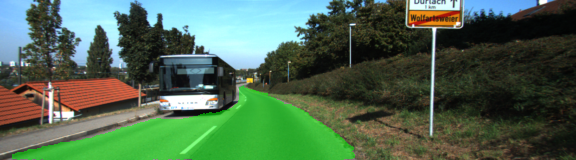
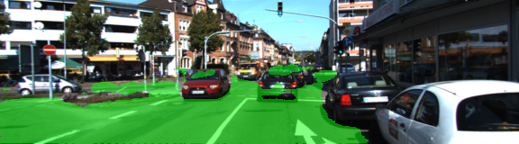
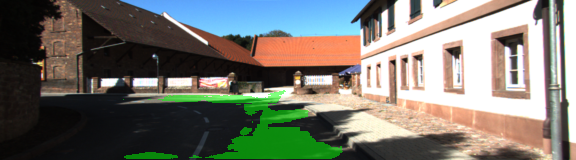

# Semantic Segmentation
Segmenting images from the [Kitti Road dataset](http://www.cvlibs.net/datasets/kitti/eval_road.php) into road and not-road pixels.

## Training

### Training Process
Semantic segmentation can be performed by building a network that uses convolution layers instead of fully connected layers. Any fully connected layer with 'k' neurons is replaced with a convolution layer with output depth 'k'. For the last layer in the network, the value of 'k' is equal to the number of classes in the classification task. The ground truth for training is in the form pixel masks having the same size as the training images themselves. In our case, training images and ground truth masks were provided by Udacity. The training was done on a Lenovo Y520 Laptop with Nvidia 1050Ti GPU having compute capability. The average training time per epoch was 2.5 min.

### The Network
The network used is [FCN8](https://people.eecs.berkeley.edu/~jonlong/long_shelhamer_fcn.pdf), which is the [VGG16](https://www.kaggle.com/keras/vgg16) network with its first two fully connected layers, having size 4096, replaced by convolution layers with depth 4096 each. Pre-trained weights for FCN8 were already provided.

Three upsampling layers were added to this network that perform transpose deconvolution to increase the resolution by 2x, 2x and 8x respectively, ultimately generating an output having the same height and width as the input to the network. The depth of every upsampling layer was made 2, because our task was a binary classification (road vs not-road). The output of the first upsampling layer was combined with the output of the 4th maxpooling layer from FCN8 and the output of the second upsampling layer was combined with the output of the 3rd maxpooling layer from FCN8. Since the maxpooling layers from FCN8 had depth more than 2, 1x1 convolutions with depth 2 were applied to them before the combination described above was done. 

The combination of upsampling layers with downsampling layers, also known as skip connections, lets our network 'see' the input at varying resolutions, and the resulting pixel-wise predictions are more accurate.

### Hyperparameter
Because of the large size of the network, the batch size had to be reduced to just 2 (larger batch sizes were causing OOM errors). The network was trained for 100 epochs using AdamOptimizer initialized with a learning rate of 1e-3. 

### Results
The test images were segmented nicely, with only a few missed spots. However in some images, there were false positives (like fence or sidewalk being labeled as road), or false negatives, sometimes in poor contrast situations.

### Future work
- Print IoU after every epoch
- Experiment with regularization
- Test if 4096 deep layers are indeed needed. (http://cs231n.github.io/convolutional-networks/#case)
- Experiment with Xception architecture (https://arxiv.org/pdf/1610.02357.pdf).

## Dependencies
Make sure you have the following is installed:
 - [Python 3](https://www.python.org/)
 - [TensorFlow](https://www.tensorflow.org/)
 - [NumPy](http://www.numpy.org/)
 - [SciPy](https://www.scipy.org/)
